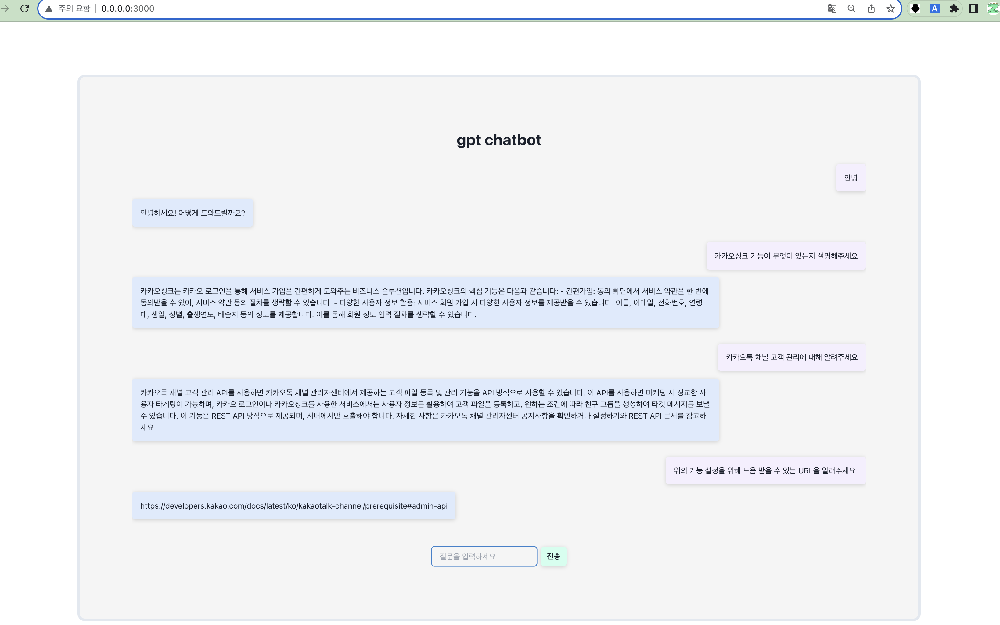

# zoey.fully
zoey.fully 의 프로젝트 저장소 입니다.
```
python==3.9.13
pip install -r requirements.txt
```

## 프로젝트 설명
```
- gpt_project: project1
- chatapp: project2
- chatapp2: project3
```

## OPENAI_API_KEY 환경 설졍
```
export OPENAI_API_KEY="여기에 키를 작성하세요"
```

## app 실행
```
# 프로젝트 경로로 이동
cd project_dir

# reflex 설정 초기화 (최초 1회 실행)
reflex init

# reflex run
reflex run
```

## 실행 예시

